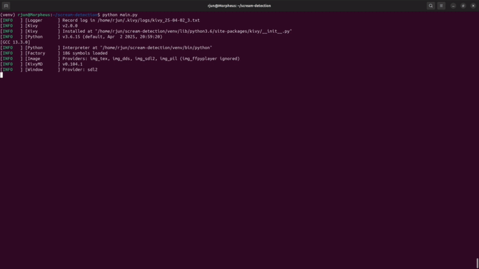
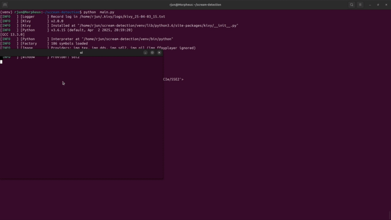

# Scream Detection

Scream Detection is a machine learning project designed to identify and classify scream-like audio events from ambient sound recordings. It leverages deep learning models to distinguish between screams (positive) and non-scream sounds (negative), making it applicable for safety monitoring, surveillance, or emergency response systems.

---

## 🔍 Features

- Binary audio classification: scream vs non-scream  
- Preprocessed audio samples using MFCC features  
- CNN-based model architecture  
- Real-time and batch audio file inference capability  
- Configurable training and evaluation parameters  
- Simple file-based prediction pipeline  

---

## 📁 Project Structure

```
scream-detection/
├── fileinfo.py                             # Utility for reading file metadata
├── modelloader.py                          # Loads and initializes the model
├── negative/                               # Folder containing non-scream audio
├── requirements.txt                        # Python dependencies
├── resources/                              # Additional media or assets
├── saved_model.pb                          # Saved TensorFlow model
├── sound_classifier_nueral.py              # Main classifier code
├── testing/                                # Folder with test audio files
├── ui.kv                                   # Kivy UI layout file

```

---

## ⚙️ Installation

1. Clone the repository:  
   `git clone https://github.com/km-rjun/scream-detection.git`  
   `cd scream-detection`

2. Create a virtual environment (optional but recommended):  
   `python -m venv venv`  
   `source venv/bin/activate` (on Windows: `venv\Scripts\activate`)

3. Install dependencies:  
   `pip install -r requirements.txt`

---

## 🧪 Usage

### 1. Dataset Preparation

- Place your audio samples into the appropriate directories:
  - `negative/` for non-scream sounds
  - Create a similar directory (e.g. `positive/`) if using your own scream samples
- Use `datasetmaker.py` to process and prepare the dataset.

### 2. Model Loading & Inference

- The trained model is saved in `saved_model.pb`.
- Use `modelloader.py` to load the model.
- Run `sound_classifier_nueral.py` to perform classification on audio inputs.  
  This script uses the loaded model to analyze and predict whether an input sound is a scream or not.

### 3. Testing

- Use the `testing/` directory to store your test audio clips.
- Run the classification scripts on these samples to evaluate the model's performance.

---

## 📊 Evaluation

The model is evaluated based on:

- Accuracy  
- Precision and Recall  
- F1 Score  
- Confusion Matrix  

Evaluation metrics can be found in the logs or generated via the test script after training.

---

## 🎥 Examples

Below are example outputs for scream and non-scream audio predictions:

### ✅ Positive Prediction (Scream Detected)



### ❌ Negative Prediction (No Scream Detected)



---
